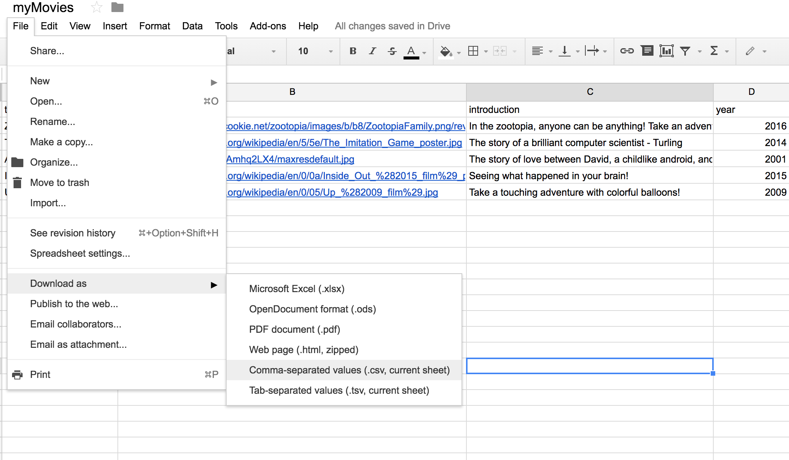
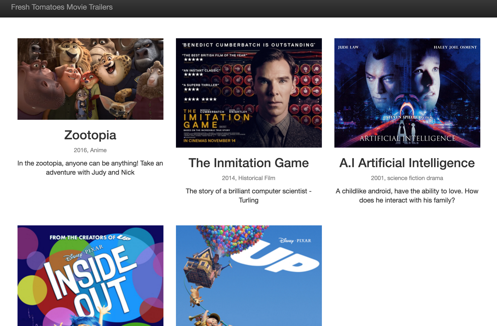

# movie-website
Udacity full stack course project

# Usage
### Step1: Create the movie data, and save it as myMovies.csv
You can use Google Sheets to help with creating csv file

### Step2: Run entertainment_center.py in python

an you should see a page like this:
